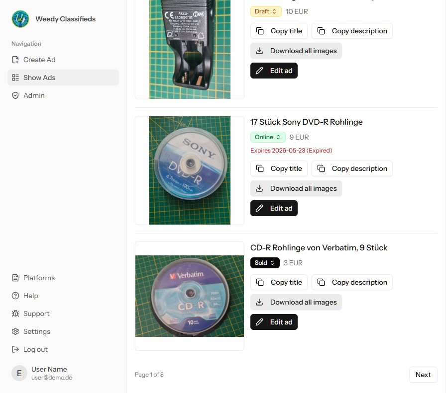

# Weedy Classifieds

[](https://github.com/butburg/kleinanz-laravel-12/releases/latest)

An AI-assisted classified-ads workspace for creating, refining, and managing listings with less repetitive work.

Built with Laravel 12, Svelte 5, Inertia, and Tailwind CSS.



## What it does

- Create and manage listings with titles, descriptions, prices, shipping sizes, platforms, and statuses.
- Upload up to ten images per ad; the browser compresses them before upload.
- Generate listing titles and descriptions from an uploaded image with OpenAI.
- Automatically detect and frame the main clothing item in a photo with a fashion-specific YOLO model. The crop preserves a small margin and leaves images that are already close-ups unchanged.
- Keep original, thumbnail, and cropped image variants available for each listing.
- Use a responsive Svelte interface, including an admin area and account settings.

## Requirements

- PHP 8.2 or later
- Composer
- Node.js 20 or later
- A MySQL-compatible database, configured in `larasvelte/.env`
- Python 3 with `pip` for the optional auto-crop feature

`OPENAI_API_KEY` is required for using AI text generation. The optional auto-crop feature also needs the ONNX model file, which is not included in this repository.

## Local setup

All Laravel commands run from `larasvelte/`.

```bash
cd larasvelte
composer install
npm install
cp .env.example .env
php artisan key:generate
```

Configure the database and any optional service keys in `.env`, then create the schema and development user:

```bash
php artisan migrate --seed
```

The seeded development account is:

- Email: `test@example.com`
- Password: `password`

### Enable smart auto-crop

Auto-crop runs in a queued job and uses a local Python environment plus an ONNX fashion-detection model.

```bash
bash scripts/setup_auto_crop_dev.sh
mkdir -p storage/models
# Place yolov8n-fashionpedia-1.onnx in storage/models/
```

The default `.env` values expect:

```dotenv
PYTHON_PATH=.venv-crop/bin/python
AUTO_CROP_MODEL_PATH=storage/models/yolov8n-fashionpedia-1.onnx
```

## Run locally

Start the Laravel server, Vite, and the queue worker in separate terminals:

```bash
# Terminal 1
cd larasvelte
php artisan serve

# Terminal 2
cd larasvelte
npm run dev

# Terminal 3
cd larasvelte
php artisan queue:work --queue=default -v
```

Open `http://localhost:8000` after the server starts.

## Useful commands

```bash
cd larasvelte

php artisan test                 # Run the test suite
php artisan test --parallel      # Run the test suite in parallel
composer run test                # Run Pint checks and tests
npm run build                    # Create a production frontend build
npm run svelte:check             # Type-check Svelte components
npm run lint                     # Fix JavaScript and Svelte lint issues
npm run format:check             # Check frontend formatting
npm run format                   # Format frontend source files
php artisan queue:work           # Process queued jobs
```

To inspect the auto-crop result for the included fixture image:

```bash
php artisan app:crop-fixture-image \
  --detection-threshold=0.65 \
  --closeup-threshold=0.80 \
  --margin-percent=2
```

The command writes `tests/fixtures/test-image_cropped.jpg` for comparison.

For systematic detector tuning, matrix mode writes one output image for every threshold combination and a JSON diagnostics report:

```bash
php artisan app:crop-fixture-image --matrix \
  --detection-min=0.10 --detection-max=0.90 \
  --closeup-min=0.10 --closeup-max=0.90 \
  --step=0.10 --margin-percent=3
```

Output files use names such as `tests/fixtures/test-image_cropped_dt010_ct020_m03.jpg`; the report is written to `tests/fixtures/test-image_cropped_matrix_report.json` and includes the crop decision, detection count, and main-item coverage.

## Further documentation

The archived migration notes and implementation guides are available in [`no_laravel/docs/`](no_laravel/docs/), including:

- [AI-assisted development](no_laravel/docs/ai-assisted-development.md)
- [Eloquent ORM patterns](no_laravel/docs/eloquent-orm-getting-started.md)
- [Browser testing with Pest](no_laravel/docs/browser-testing-pest-v4.md)
- [Validation](no_laravel/docs/validation.md)
- [File storage](no_laravel/docs/file-storage.md)

## Project structure

```text
larasvelte/
├── app/                 Laravel controllers, jobs, models, and services
├── config/ads.php       Listing, image, AI, and auto-crop settings
├── database/            Migrations, factories, and seeders
├── resources/js/        Svelte pages, layouts, and components
├── scripts/             Python auto-crop tooling and setup scripts
├── storage/models/      Local ONNX model location (git-ignored)
└── tests/               Pest tests and image fixtures
```

## Troubleshooting

**Auto-crop is not processing images**

Confirm that the queue worker is running, the model exists at `AUTO_CROP_MODEL_PATH`, and `PYTHON_PATH` points to the virtual environment created by `scripts/setup_auto_crop_dev.sh`.

**The local database needs to be rebuilt**

This deletes local application data, then recreates the schema and seeded development account:

```bash
cd larasvelte
php artisan migrate:fresh --seed
```

**Which database is the deployed application using?**

Ask Laravel for its resolved configuration rather than inspecting `.env` directly:

```bash
php artisan tinker --execute="dump(config('database.default')); dump(config('database.connections.'.config('database.default').'.database'));"
```

The command prints the active connection name and configured database name.

**Laravel commands use an older PHP version on Lima-City**

Switch the active shell session before running Artisan or Composer:

```bash
export PATH="/opt/lima-php/8.4/bin:$PATH"
```

**Vite changes are not appearing**

Restart `npm run dev`, or use `npm run build` when preparing a production deployment.

## License

See [LICENSE](LICENSE) for details.
